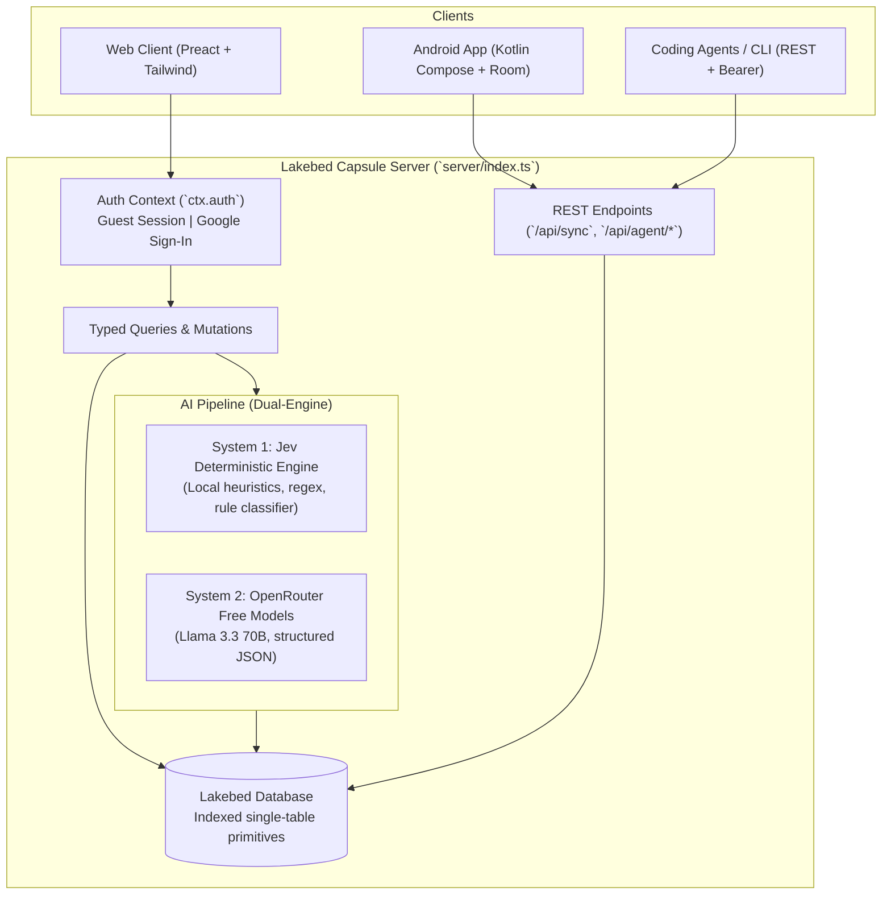
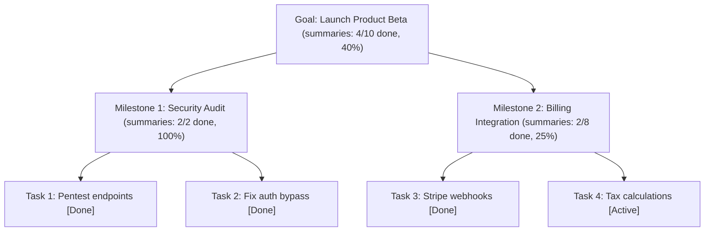
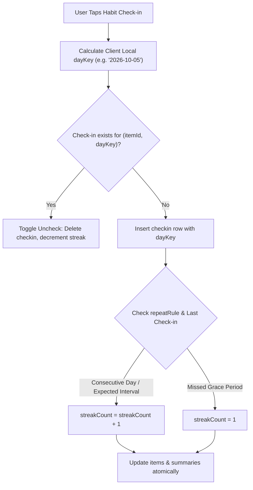
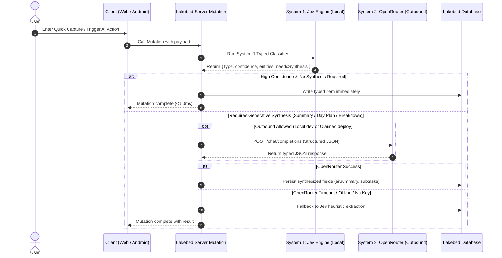
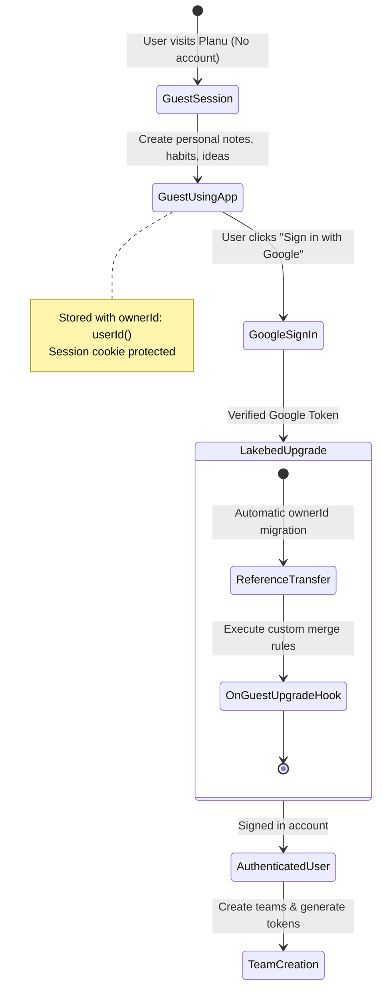

# Planu — Specification

> **Spec status (2026-10-05):** Target architecture. Current code is still the Lakebed starter (`todos` table only in `server/index.ts`, todo list + `/status` in `client/index.tsx`). Build Phase 0 → Phase 1 incrementally; do not treat this spec as implemented until §4 schema lands. See §15 for conformance table.

## 1. Vision & Executive Summary

Planu is a unified, AI-first productivity workspace combining personal task management, structured thinking, and team execution. It replaces fragmented tooling with a single, coherent primitive system:

- **Docs / Wiki / Structured Notes** (replacing Notion)
- **Fast Capture & Idea Dump** (replacing Google Keep)
- **Visual Kanban Boards** (replacing Trello)
- **Goals, Milestones, Habits & Team Alignment** (replacing ClickUp / Taskflow)

Instead of bolting AI onto a legacy sidebar or chat widget, Planu treats AI as an inline copilot: every capture, triage, summarization, planning, and breakdown action is AI-assisted and strictly typesafe.

**Capsule Root:** `C:\sites\planu` (Lakebed capsule)  
**Target Deployments:** Lakebed Cloud (Web + Backend) and Native Android (Jetpack Compose).



---

## 2. Core Architectural Principles

1. **AI-First & Typesafe (Typed Judgments):** Every AI operation produces a strictly validated TypeScript schema (System 1 "Jev" judgment). AI never writes unstructured or unvalidated text directly to database tables.
2. **Three Core Primitives Only:** 
   - **Personal Workspace** (Notes, Plans, Goals, Habits, Ideas)
   - **Teams & Collaboration** (Shared workspaces, explicit membership, role enforcement)
   - **Kanban & Projects** (Structured pipelines, cards, drag-and-drop ordering)  
   All specialized concepts (habit trackers, daily agendas, goal trees, idea inboxes) are views or typed subsets of the central `items` primitive.
3. **Capture in < 3 Seconds:** Fast capture is accessible from anywhere (Web: `Ctrl/Cmd+K` global palette; Android: homescreen widget / share target). Notes and ideas ingest with minimal latency and triage asynchronously.
4. **Server-Authoritative Web, Offline-Tolerant Android:** The Lakebed capsule acts as the single source of truth. The Android client caches via local Room storage and syncs via cursor-based delta endpoints.
5. **Zero Fake Globals & Strict Tenant Isolation:** All personal items are isolated by `ownerId: userId()`. Team items are bound by explicit `memberships` rows and validated in every query and mutation.
6. **Resilience & Fallbacks:** Core productivity flows (task management, habits, kanban, capture) remain 100% operational offline and when external AI APIs are unreachable.

---

## 3. Repository Layout & Platform Constraints

```text
/                  # Lakebed capsule root (this repository)
  spec.md          # Architectural & product specification
  AGENTS.md        # Lakebed environment limits & instructions
  README.md        # Quickstart & local dev instructions
  server/          # Lakebed server runtime
    index.ts       # Capsule export: schema, queries, mutations, endpoints
  client/          # Preact web application
    index.tsx      # Main application router and UI views
  shared/          # Pure TypeScript (zero DOM, Node, or Lakebed runtime dependencies)
    planu.ts       # Domain entities, item types, and state enums
    ai.ts          # Typed Jev judgment schemas & prompt interfaces
    jev.ts         # System 1 deterministic classifier (regex, syntax parsing, PII scrub)
    sync.ts        # Delta sync payloads and mutation envelope types
    ordering.ts    # Kanban fractional midpoint & Lexorank calculations
    habits.ts      # Habit repeat rules, dayKey helpers, and streak formulas
  android/         # OUT OF CAPSULE SCOPE for MVP — separate Gradle module, separate repo/deploy.
                   # Talks to capsule only via REST (`/api/sync/*`, `/api/agent/*`). See §10, §15.
  favicon.svg      # Capsule favicon
```

### Lakebed Alpha Invariants & Guardrails
- **No arbitrary npm packages:** App code must not introduce third-party Node packages or native Node modules in capsule runtime. Use pure TypeScript algorithms in `shared/`.
- **Database Column Types:** Permitted types are `string()`, `boolean()`, `number()`, `id("table_name")`, and `userId()`. Optionality via `.optional()` and defaults via `.default(val)`.
- **No In-Database JSON or Arrays:** Complex nested objects or array values must be stored as serialized JSON strings (`string()`).
- **Index-Only Queries:** All database lookups must leverage declared `.index(name, [fields])` via `withIndex`. Unindexed table scans are prohibited.
- **Handler Read Budgets:** Handler read quotas apply per invocation. Long-running loops over `paginate()` are forbidden; rollup totals (goal progress, habit streaks, card counts) are maintained incrementally via summary rows.
- **Outbound Fetching:** Server-side `fetch` requires a claimed deploy on Lakebed hosting. Local dev supports outbound requests directly.
- **User Ownership:** Declared `userId()` columns automatically migrate to authenticated Google accounts upon guest sign-in. Plain string IDs do not migrate automatically.
- **No legacy query style:** Never use `.where`, `.orderBy`, `.limit`, or `.all`. Use `.withIndex(...).first()` / `.collect()` plus `by_creation` for unfiltered creation-order reads. The starter's `.order("desc")` without `withIndex` must be removed when §4 schema lands.
- **Phase 0 gap (current code):** `todos` table + `addTodo` + `/api/status` only. Phase 1 replaces `todos` with §4 tables; keep `GET /api/status` as health check.

---

## 4. Universal Data Model & Lakebed Schema

The data model consolidates productivity primitives into normalized, indexed Lakebed tables:

### 4.1 Lakebed Capsule Schema Declaration (`server/index.ts`)

```ts
import { boolean, capsule, id, number, string, table, userId } from "lakebed/server";

export const schema = {
  // Central polymorphic entity: notes, plans, goals, milestones, habits, tasks, ideas
  items: table({
    ownerId: userId(),                          // Owner identity (migrates on Google sign-in)
    scopeKind: string().default("personal"),    // "personal" | "team"
    teamId: id("teams").optional(),             // Set when scopeKind === "team"
    projectId: id("projects").optional(),       // Attached kanban project board
    type: string(),                             // "note" | "plan" | "goal" | "milestone" | "habit" | "task" | "idea"
    title: string(),                            // Card / Note / Goal title
    body: string().default(""),                 // Markdown-lite content or habit details
    status: string().default("inbox"),          // "inbox" | "active" | "done" | "archived"
    priority: number().default(2),              // 1 (high), 2 (normal), 3 (low)
    dueAt: number().optional(),                 // Epoch timestamp (ms)
    repeatRule: string().optional(),            // Habits: "daily" | "weekdays" | "weekly:mon,thu"
    streakCount: number().default(0),           // Maintained habit / check-in streak
    lastCheckedAt: number().optional(),         // Epoch timestamp of last completion
    parentId: id("items").optional(),           // Goal -> Milestone -> Task parent chain
    kanbanColumn: string().optional(),          // "todo" | "doing" | "done" | custom column key
    kanbanOrder: number().default(1000),        // Fractional midpoint order within column
    aiSummary: string().optional(),             // Cached AI summary or breakdown
    aiNextAction: string().optional(),          // Actionable next step suggested by AI
    createdAt: number(),                        // Epoch ms
    updatedAt: number(),                        // Epoch ms (for delta sync LWW)
    deletedAt: number().optional()              // Tombstone timestamp for offline sync
  })
    .index("by_owner", ["ownerId"])
    .index("by_owner_type", ["ownerId", "type"])
    .index("by_owner_status", ["ownerId", "status"])
    .index("by_team", ["teamId"])
    .index("by_project", ["projectId"])
    .index("by_parent", ["parentId"])
    .index("by_owner_updated", ["ownerId", "updatedAt"]),

  // Kanban and list projects
  projects: table({
    ownerId: userId(),
    teamId: id("teams").optional(),             // Optional team ownership
    name: string(),
    description: string().default(""),
    boardColumns: string().default('["todo","doing","done"]'), // Serialized JSON string array
    color: string().default("#3b82f6"),
    createdAt: number(),
    updatedAt: number()
  })
    .index("by_owner", ["ownerId"])
    .index("by_team", ["teamId"]),

  // Team collaboration spaces
  teams: table({
    ownerId: userId(),                          // Original team creator
    name: string(),
    requireSignIn: boolean().default(false),    // If true, guests must sign in before accessing
    createdAt: number(),
    updatedAt: number()
  })
    .index("by_owner", ["ownerId"]),

  // Membership & role bindings
  memberships: table({
    teamId: id("teams"),
    userId: userId(),                           // Member's user identifier
    role: string().default("member"),           // "owner" | "admin" | "member" | "guest"
    inviteStatus: string().default("active"),   // "active" | "invited" | "declined"
    invitedEmail: string().optional(),
    createdAt: number(),
    updatedAt: number()
  })
    .index("by_team", ["teamId"])
    .index("by_user", ["userId"])
    .index("by_team_user", ["teamId", "userId"]),

  // Secure team invite tokens
  teamInvites: table({
    teamId: id("teams"),
    tokenHash: string(),                        // SHA-256 hash of shareable invite secret
    role: string().default("member"),           // Role granted upon redemption
    createdById: userId(),
    expiresAt: number(),                        // Expiration epoch ms
    maxUses: number().default(0),               // 0 = unlimited
    usedCount: number().default(0),
    revoked: boolean().default(false),
    createdAt: number()
  })
    .index("by_token", ["tokenHash"])
    .index("by_team", ["teamId"]),

  // Daily habit & milestone check-in logs
  checkins: table({
    itemId: id("items"),
    userId: userId(),
    dayKey: string(),                           // "YYYY-MM-DD" local calendar bucket for idempotency
    at: number(),                               // Epoch ms
    value: number().default(1)                  // Quantity or boolean completion (1 / 0)
  })
    .index("by_item", ["itemId"])
    .index("by_item_day", ["itemId", "dayKey"])
    .index("by_user_at", ["userId", "at"]),

  // Precomputed rollups (avoids table scans & respects read budgets)
  summaries: table({
    refKind: string(),                          // "goal" | "milestone" | "project" | "habit"
    refId: string(),                            // ID of referenced entity
    doneCount: number().default(0),
    totalCount: number().default(0),
    streakCount: number().default(0),
    updatedAt: number()
  })
    .index("by_ref", ["refKind", "refId"]),

  // Developer & coding-agent API tokens
  agentTokens: table({
    ownerId: userId(),
    name: string(),
    tokenHash: string(),                        // SHA-256 hash of API key
    scopes: string(),                           // Serialized JSON array: e.g. '["read:items","write:items"]'
    expiresAt: number(),
    revoked: boolean().default(false),
    createdAt: number(),
    lastUsedAt: number().optional()
  })
    .index("by_owner", ["ownerId"])
    .index("by_token", ["tokenHash"])
};
```

### 4.2 Shared Domain Types (`shared/planu.ts`)

```ts
export type ItemType = "note" | "plan" | "goal" | "milestone" | "habit" | "task" | "idea";
export type ItemStatus = "inbox" | "active" | "done" | "archived";
export type ScopeKind = "personal" | "team";
export type TeamRole = "owner" | "admin" | "member" | "guest";
export type InviteStatus = "active" | "invited" | "declined";

export interface Item {
  id: string;
  ownerId: string;
  scopeKind: ScopeKind;
  teamId?: string;
  projectId?: string;
  type: ItemType;
  title: string;
  body: string;
  status: ItemStatus;
  priority: 1 | 2 | 3;
  dueAt?: number;
  repeatRule?: string;
  streakCount: number;
  lastCheckedAt?: number;
  parentId?: string;
  kanbanColumn?: string;
  kanbanOrder: number;
  aiSummary?: string;
  aiNextAction?: string;
  createdAt: number;
  updatedAt: number;
  deletedAt?: number;
}

export interface Project {
  id: string;
  ownerId: string;
  teamId?: string;
  name: string;
  description: string;
  boardColumns: string[];
  color: string;
  createdAt: number;
  updatedAt: number;
}

export interface Summary {
  refKind: "goal" | "milestone" | "project" | "habit";
  refId: string;
  doneCount: number;
  totalCount: number;
  streakCount: number;
  updatedAt: number;
}
```

---

## 5. Core Block A — Personal Workspace Engine

The personal workspace serves as the default operational context for single users.

### 5.1 Self Notes
- **Editor:** Markdown-lite with autosave debounce (500ms).
- **AI Transformations:**
  - *Summarize:* Generates concise 2-sentence executive summary in `aiSummary`.
  - *Extract Tasks:* Analyzes note body, extracts actionable checkboxes, and creates child `task` items linked by `parentId`.
  - *Refactor / Cleanup:* Clarifies grammar, tightens phrasing, and generates tag suggestions.

### 5.2 Daily & Weekly Agenda ("Today" View)
- Aggregates:
  1. Active habits due today.
  2. Tasks with `dueAt` falling within the current calendar day or overdue.
  3. Unprocessed ideas in `inbox` status.
- **AI Day Planner (`aiPlanDay`):** Synthesizes overdue tasks, active habits, and daily priorities into an optimized ordered itinerary with estimated time allocations and rationale.

### 5.3 Goal Hierarchy & Recursive Rollup Engine
Goals represent multi-week or multi-month outcomes broken down into measurable milestones and tactical tasks:



- **Enforced Chain:** `goal` (top-level) $\rightarrow$ `milestone` (intermediate) $\rightarrow$ `task` (leaf).
- **Zero Full-Table Scans:** Progress is never computed via `paginate()` or unbounded queries. When any child item transitions to/from `status: "done"`:
  1. The server reads the parent's `summaries` row.
  2. Increments or decrements `doneCount`.
  3. If the parent has a `parentId` (milestone $\rightarrow$ goal), it updates the grandparent's `summaries` row recursively.
  4. Returns the updated summary in the mutation response.

### 5.4 Habits & Streak Calculation Engine
Habits track recurring behaviors with zero-friction daily check-ins.



- **Idempotent Day Buckets:** The client computes and passes `dayKey` (formatted `YYYY-MM-DD` matching the user's local timezone) along with timestamp `at`.
- **Duplicate Prevention:** The server checks `checkins` index `by_item_day (["itemId", "dayKey"])`. Clicking again acts as an uncheck/toggle.
- **Repeat Rules Supported:**
  - `"daily"`: Must be checked every 24-36h window.
  - `"weekdays"`: Mon–Fri required; Friday streaks carry across Saturday & Sunday to Monday without penalty.
  - `"weekly:mon,thu"`: Checked on nominated days only; intervening days do not break the streak.
- **AI Habit Coach (`aiHabitCoach`):** Examines check-in density over the past 14 days and detects friction points (e.g., "You consistently miss habits scheduled on Friday afternoons; consider moving to morning routines.").

---

## 6. Core Block B — Teams & Collaboration Engine

Team collaboration enables shared boards, project roadmaps, and delegated tasks under strict multi-tenant boundary checks.

### 6.1 Membership Lifecycle & Role Permissions

| Role | Read Items | Create/Edit Items | Manage Projects | Invite / Remove Members | Delete Team |
|---|:---:|:---:|:---:|:---:|:---:|
| **Owner** | Yes | Yes | Yes | Yes | Yes |
| **Admin** | Yes | Yes | Yes | Yes | No |
| **Member** | Yes | Yes | Yes | No | No |
| **Guest** | Read-Only | Comments/Check-ins only | No | No | No |

### 6.2 Team Invitation Flow
1. **Invite Generation:** An Admin or Owner calls `createTeamInvite({ teamId, role, expiresInHours, maxUses })`.
2. The server generates a cryptographically secure random token (e.g., `planu_inv_...`), stores `SHA-256(token)` in `teamInvites`, and returns a shareable link: `https://planu.app/join?token=<token>`.
3. **Redemption Paths:**
   - **Open Team:** Guest session is created automatically; a `memberships` row is inserted with `role: "guest"` or `"member"`. Guest sees only this team's scope.
   - **Account-Gated Team (`requireSignIn: true`):** The invite endpoint returns `{ requireSignIn: true }`. The client mounts `SignInWithGoogle`. Upon successful authentication, the server redeems the token and binds the authenticated `userId()`.

### 6.3 Team Isolation Guarantee
Every query accessing team data validates membership first:
```ts
const membership = await ctx.db.memberships
  .withIndex("by_team_user", (q) => q.eq("teamId", teamId).eq("userId", callerUserId))
  .first();
if (!membership || membership.inviteStatus !== "active") {
  throw new Error("Access denied: Not an active member of this team");
}
```

---

## 7. Core Block C — Kanban & Project Engine

Projects structure tasks into visual columns with fractional ordering.

### 7.1 Fractional Midpoint Ordering (Lexorank Alternative)
To prevent re-indexing all cards in a column when a card is dropped between two existing cards, Planu uses a fractional midpoint ordering algorithm:

```ts
// shared/ordering.ts
export function calculateMidpoint(prevOrder?: number, nextOrder?: number): number {
  if (prevOrder === undefined && nextOrder === undefined) return 1000;
  if (prevOrder === undefined) return nextOrder! / 2;
  if (nextOrder === undefined) return prevOrder + 1000;
  return (prevOrder + nextOrder) / 2;
}

export function requiresRebalance(prevOrder: number, nextOrder: number): boolean {
  return Math.abs(nextOrder - prevOrder) < 1e-4;
}
```

- When moving a card between Card A (`order = 1000`) and Card B (`order = 2000`), the moved card receives `1500`.
- If precision falls below `1e-4`, the mutation executes a localized column rebalance, spacing cards at even intervals of `1000`.

### 7.2 Views
1. **Board View:** Multi-column drag-and-drop. Cards show title, due badge, priority, and AI summary indicator.
2. **List View:** Grouped by status, priority, or milestone.
3. **Calendar View:** Read-only temporal overview grouping cards with `dueAt` timestamps by day.

---

## 8. AI-First Architecture: Dual-Engine Pipeline

Planu employs a dual-engine architecture to achieve instant reactivity, cost efficiency, and full offline/local resilience:



### 8.1 System 1: Jev Deterministic Engine (`shared/jev.ts`, types in `shared/ai.ts`)
- **Characteristics:** Runs synchronously within the server handler in < 5ms. Zero external network calls. Zero token cost.
- **Capabilities:**
  - Token and syntax extraction: `#tag`, `@project`, `!p1`, `due:tomorrow`, `type:habit`.
  - Intent routing: determines whether capture text represents an idea, task, note, or habit.
  - PII scrubbing and content sanitization.
  - Deterministic fallback when OpenRouter is unavailable.

### 8.2 System 2: OpenRouter Free-Tier Engine
- **Provider:** OpenRouter (`https://openrouter.ai/api/v1`).
- **Default Model:** `meta-llama/llama-3.3-70b-instruct:free` (configurable via `OPENROUTER_MODEL` server env).
- **Authentication:** `OPENROUTER_API_KEY` stored in `.env.lakebed.server` and accessed via `ctx.env`.
- **Response Format:** Strictly enforced JSON schema via prompt constraints and validation against TypeScript types in `shared/ai.ts`.

### 8.3 Jev & AI Action Catalog

| Action | Primary Input | Output Schema | Fallback Behavior |
|---|---|---|---|
| `routeCapture` | Raw dump text | `{ type: ItemType, title: string, dueAt?: number, priority: 1\|2\|3, confidence: number }` | Regex pattern matching |
| `extractTasks` | Note markdown body | `{ tasks: Array<{ title: string, dueAt?: number, priority: 1\|2\|3 }> }` | Checkbox `- [ ]` markdown extractor |
| `aiPlanDay` | Inbox items, habits, overdue tasks | `{ schedule: Array<{ itemId: string, timeSlot: string, reason: string }>, summary: string }` | Sort by priority and due date |
| `aiBreakdown` | Goal or task title | `{ subtasks: Array<{ title: string, priority: 1\|2\|3 }> }` | Single starter task creation |
| `aiHabitCoach` | 14-day check-in history | `{ observation: string, suggestion?: string }` | Streak milestone praise |

---

## 9. Cross-Cutting Capabilities

### 9.1 < 3s Idea Dump & Quick Capture
- Global keyboard shortcut: `Ctrl+K` / `Cmd+K` anywhere in the web app.
- Natural Language Syntax Support:
  - `"Draft quarterly investor report @Finance !p1 due:friday"`
  - Parsed into: `title: "Draft quarterly investor report"`, `projectId: <FinanceId>`, `priority: 1`, `dueAt: <FridayEpoch>`.
- One-tap promotion (`promoteIdea` mutation): Converts an inbox `idea` into a `task`, `habit`, `goal`, or `note` in place, preserving timestamps and history.

### 9.2 Split-View Multitasking (`?left=&right=`)
- URL query string parameterization: `/?left=<paneA>&right=<paneB>`
- Valid pane specifiers:
  - `personal:today` (Personal daily agenda)
  - `personal:dump` (Personal idea inbox)
  - `board:<projectId>` (Project kanban board)
  - `team:<teamId>` (Team item stream)
  - `item:<itemId>` (Direct note / goal document editor)
- **Drag-and-Drop Scope Transfer:** Dragging a card from a personal pane to a team board pane triggers `changeItemScope({ id, newScopeKind: "team", newTeamId })`.
- **Local-test constraint:** `?lakebed_guest=<name>` is reserved for guest-override testing. Split-view must merge params via `URLSearchParams` (preserve `lakebed_guest`), never overwrite `location.search` wholesale.

### 9.3 Developer & Coding-Agent API
Enables external autonomous agents, CLIs, and integrations to interact with Planu workspaces:

- **Token Format:** `planu_pat_<32_random_hex_chars>`
- **Storage:** Only `SHA-256` hash is persisted in `agentTokens`. Plaintext token shown once on creation.
- **Header:** `Authorization: Bearer planu_pat_...` (distinct from Lakebed's `X-Lakebed-Token`).
- **Supported Scopes:**
  - `items:read`, `items:write`
  - `projects:read`, `projects:write`
  - `teams:read`, `teams:write`
  - `ai:execute`
- **Agent Endpoints:**
  - `GET /api/agent/items` (filter by type, status, projectId, limit, cursor)
  - `POST /api/agent/items` (create new notes, tasks, or ideas)
  - `PATCH /api/agent/items?id=<id>` (update status, body, or kanban column; `id` also accepted in JSON body — endpoint paths are exact-match, see §15)
  - `DELETE /api/agent/items?id=<id>` (soft-delete item; `id` also accepted in JSON body)
  - `POST /api/agent/ai/triage` (trigger AI categorization on inbox items)

---

## 10. Android App Architecture & Sync Protocol

```text
android/
  settings.gradle.kts
  build.gradle.kts
  app/
    build.gradle.kts
    src/main/
      AndroidManifest.xml
      java/com/planu/app/
        PlanuApplication.kt       # Application class & DI setup
        MainActivity.kt           # Jetpack Compose single-activity host
        data/
          local/                  # Room Database
            PlanuDatabase.kt
            ItemDao.kt
            CheckinDao.kt
            PendingMutationDao.kt # Offline mutation write-ahead queue
          remote/                 # Retrofit / OkHttp
            PlanuApiClient.kt     # Injects X-Lakebed-Token & Authorization
            SyncService.kt
          sync/                   # WorkManager background sync engine
            SyncWorker.kt         # Periodic & triggered synchronization
        ui/
          theme/                  # Material 3 & Tailwind palette parity
          capture/                # Fast Capture Sheet & Widget receiver
          today/                  # Today agenda & habit check-in screen
          board/                  # Kanban board with drag-and-drop
          split/                  # Dual-pane tablet layout & quick-switcher
```

### 10.1 Bidirectional Sync Protocol

```mermaid
sequenceDiagram
    autonumber
    participant App as Android Room DB
    participant Sync as WorkManager SyncWorker
    participant API as Lakebed Capsule Endpoints

    Note over App,API: Phase 1: Push Offline Mutations
    Sync->>App: Read uncommitted rows from pending_mutations
    Sync->>API: POST /api/sync/push { mutations: [...] }
    API->>API: Process in single transaction (LWW)
    API-->>Sync: Return { confirmedMutationIds, rejectedErrors }
    Sync->>App: Clear confirmed mutations

    Note over App,API: Phase 2: Pull Server Changes
    Sync->>API: GET /api/sync/pull?since=lastSyncTimestamp
    API-->>Sync: Return { items, checkins, tombstones, serverTime }
    Sync->>App: Upsert items & checkins; delete tombstoned rows
    Sync->>App: Store lastSyncTimestamp = serverTime
```

- **Conflict Resolution:** Server Last-Write-Wins (LWW) based on `updatedAt`.
- **Tombstones:** Deleted items are marked with `deletedAt: number`. Tombstones are propagated during sync and retained for 30 days before purge.
- **Offline Queuing:** If network is unreachable, writes are appended to `pending_mutations`. `WorkManager` retries automatically when connectivity restores.

---

## 11. Web Client Architecture & UX Routes

### 11.1 Route Table (Preact Router)
- `/`: **Today Dashboard** (Daily plan, active habits, inbox count, AI Plan trigger).
- `/dump`: **Idea Dump** (Instant capture list, bulk triage, type promotion).
- `/notes`: **Notes Workspace** (Document list, markdown editor, AI summary & task extraction).
- `/goals`: **Goals & Milestones** (Tree hierarchy, recursive progress bars).
- `/habits`: **Habit Tracker** (Streak heatmaps, cadence configuration, coach insights).
- `/boards/:projectId`: **Kanban Board** (Drag-and-drop columns, filter by priority).
- `/teams/:teamId`: **Team Space** (Shared projects, member roster, role administration).
- `/join`: **Team Invite Landing** (Token redemption, guest access or Google sign-in gate).
- `/settings/tokens`: **Developer & Agent Access** (Create, view, and revoke API tokens).

### 11.2 Global Keyboard Shortcuts Table
| Shortcut | Action |
|---|---|
| `Cmd/Ctrl + K` | Open Universal Quick Capture & Command Palette |
| `Cmd/Ctrl + \` | Toggle Dual-Pane Split View |
| `Cmd/Ctrl + 1` | Navigate to Today Dashboard |
| `Cmd/Ctrl + 2` | Navigate to Idea Dump |
| `Cmd/Ctrl + 3` | Navigate to Kanban Boards |
| `Cmd/Ctrl + 4` | Navigate to Goals & Milestones |
| `J` / `K` | Move selection down / up in item lists |
| `X` | Toggle completion status of selected item |
| `E` | Open inline editor for selected item |

---

## 12. Security, Permissions & Guest Migration Matrix



### 12.1 Guest Migration Invariants
- Lakebed automatically updates all tables with declared `userId()` columns (`items.ownerId`, `projects.ownerId`, `checkins.userId`, `agentTokens.ownerId`, `memberships.userId`) to match the newly authenticated Google user.
- If the authenticated Google account already possesses existing records, the migrated items merge into the account without data loss.

### 12.2 Permissions Matrix

| Actor | Personal Items | Team Items (Active Member) | Team Items (Guest Link) | Team Settings (Admin/Owner) | Agent Token Management |
|---|:---:|:---:|:---:|:---:|:---:|
| **Guest User** | Full Access | No Access | Read-Only (if allowed) | No Access | No Access |
| **Signed-in Member** | Full Access | CRUD | Read-Only | No Access | Full Access |
| **Team Admin / Owner** | Full Access | CRUD | CRUD | Full Access | Full Access |
| **Agent Token** | Scoped Grant | Scoped Grant | No Access | No Access | No Access |

---

## 13. Phased Implementation Roadmap

```mermaid
gantt
    title Planu Phased Implementation Roadmap
    dateFormat  X
    axisFormat Step %x

    section Phase 1: Primitives
    Domain types & Lakebed schema         :active, 0, 1
    Idea Dump & Fast Capture (<3s)        :1, 2
    Notes editor & basic Markdown         :2, 3

    section Phase 2: Personal Engine
    Today Dashboard & agenda view         :3, 4
    Goal hierarchy & recursive rollups    :4, 5
    Habits & idempotent dayKey engine     :5, 6

    section Phase 3: Boards & Teams
    Kanban board & midpoint ordering      :6, 7
    Team spaces, roles & secure invites   :7, 8
    Dual-Pane split view (?left=&right=)  :8, 9

    section Phase 4: AI Engine
    Jev System 1 deterministic engine     :9, 10
    OpenRouter System 2 integration       :10, 11
    AI day planner & triage workflows     :11, 12

    section Phase 5: External & Mobile
    Agent token auth & REST endpoints     :12, 13
    Delta sync endpoints (/api/sync/*)    :13, 14
    Android Kotlin shell & Room sync      :14, 15
```



---

## 14. Verification, Testing & Operational Runbook

### 14.1 Local Development Verification
1. Start dev server:
   ```sh
   npx lakebed dev
   ```
2. Verify endpoints and routes in a separate terminal:
   ```sh
   # Verify health check
   curl http://localhost:3000/api/status

   # Inspect real-time logs
   npx lakebed logs --port 3000

   # Dump database state
   npx lakebed db dump --port 3000
   ```
3. Multi-Session & Guest Testing:
   - Profile A: `http://localhost:3000/?lakebed_guest=alice`
   - Profile B: `http://localhost:3000/?lakebed_guest=bob`
   - Test team creation by Alice, generate invite link, and accept as Bob. Verify tenant boundaries prevent Bob from viewing Alice's personal items.

### 14.2 AI Engine Offline & Resiliency Verification
1. Run without `OPENROUTER_API_KEY`: verify Jev System 1 successfully parses quick-capture syntax, extracts `#tags`, and categorizes items without server crashes.
2. Provide valid key in `.env.lakebed.server`: verify structured summary generation and day planning.

### 14.3 Deployment & Hosted Claiming
```sh
npx lakebed deploy
```
- If prompted to claim for outbound `fetch` or secrets, complete claiming via the printed CLI instructions.
- Inspect deployed status:
  ```sh
  npx lakebed inspect <deploy-id-or-url>
  ```

---

## 15. Implementation Status & Conformance (added 2026-10-05)

| Phase | Spec section | Code status today |
|---|---|---|
| Phase 0: Starter | §3, §14 | SUPERSEDED 2026-10-05 — `todos` removed, replaced by §4 tables |
| Phase 1: Primitives | §4 (items/projects), §5.1, §9.1 | DONE 2026-10-05 — `items` + `projects` (+`checkins`, `summaries` for habits/rollups) live, `todos` removed; deviations: `createdAt` dropped (Lakebed reserves it as implicit metadata), app timestamp renamed `updatedAt`→`mtime` (Lakebed reserves `updatedAt`), index `by_owner_updated` keys `["ownerId","mtime"]` |
| Phase 2: Personal engine | §5.2–5.4, §11 | DONE 2026-10-05 — Today (`today` query, ≤3 indexed reads), goals tree + `summaries` rollups, habits `checkin_toggle` with `dayKey` idempotency, routes `/`, `/dump`, `/notes`, `/goals`, `/habits` |
| Phase 3: Boards & teams | §6, §7, §9.2 | DONE 2026-10-05 — kanban `card_move` midpoint + `1e-4` rebalance, `/boards/:projectId`, teams/invites mutations + `/teams/:teamId` + `/join`, split-view `?left=&right=` via `URLSearchParams` merge |
| Phase 4: AI engine | §8 (+ `shared/jev.ts`, `shared/ai.ts`) | DONE (Jev-only) 2026-10-05 — `routeCapture`/`extractTasks`/day-plan fallback, zero outbound `fetch`; OpenRouter still behind claimed deploy only (not wired) |
| Phase 5: External & mobile | §9.3, §10 | DONE 2026-10-05 — `agentTokens` + full agent CRUD (`GET`/`POST`/`PATCH`/`DELETE /api/agent/items`, `POST /api/agent/ai/triage`) + `/api/sync/push|pull` (LWW, tombstones) live; cursor pagination on `items_list` + agent list (`{rows,nextCursor}`, cursor filters `by_owner_updated`, helpers in `shared/pagination.ts` unit-tested); Android Room client still outside capsule per spec (non-goal §16.2); deviations: Lakebed endpoint paths are exact-match (no `:id` segments — `PATCH`/`DELETE` take `id` via `?id=` or JSON body), filtered-list cursors slice in memory (unfiltered cursor pushes `lt/eq` range into `by_owner_updated`) |

Rule: each phase PR must flip its row to DONE and note deviations here. Spec text wins over stale code, code wins as proof of what runs.

## 16. MVP Scope, Non-Goals & Acceptance Criteria

### 16.1 MVP = Phase 1 + Jev-only triage
1. `items` + `projects` tables with indexes from §4.1 (subset: skip `teams`, `teamInvites`, `agentTokens`, `summaries` until Phase 3).
2. Idea Dump (`/dump`) with <3s capture + `routeCapture` via Jev only (no outbound fetch).
3. Today view (`/`) reading `by_owner_status` + `by_owner_type` — max 3 indexed reads, no `paginate()` loops.
4. Notes editor with autosave + local `extractTasks` checkbox fallback.
5. Keep `GET /api/status`; keep guest flow + Google sign-in from starter.

### 16.2 Explicit non-goals for this capsule (alpha)
- Native Android build inside `npx lakebed deploy` (separate module, talks REST only).
- Server cron / scheduler / durable queues — use external scheduler calling `POST /api/sync/*` with an app secret (per AGENTS.md), one small batch per call, cursor returned.
- User file uploads (only `favicon.*` is static; use `client.storage` if uploads ever needed).
- Realtime collab / presence; public anonymous share links without a `memberships` row.
- OpenRouter synthesis on unclaimed deploys or without `OPENROUTER_API_KEY` (must fall back to Jev, never crash).

### 16.3 Acceptance checklist (run with `npx lakebed dev` on port 3000)
- [ ] `curl localhost:3000/api/status` → `ok`.
- [ ] `?lakebed_guest=alice` creates item; `?lakebed_guest=bob` cannot read it (`db dump` shows distinct `ownerId`).
- [ ] Capture `Draft report @Finance !p1 due:friday` parses title/project/priority/due without network.
- [ ] Kill network / unset `OPENROUTER_API_KEY` → capture, habits, kanban move still work (Jev fallback).
- [ ] No handler uses `paginate()` loops for counts; progress comes from `summaries` rows.

## 17. API Contract & Error Model

### 17.1 Naming (to add as built)
- Queries: `items_list`, `items_get`, `today`, `projects_list`, `summaries_get`.
- Mutations: `items_create`, `items_update`, `items_setStatus`, `promoteIdea`, `changeItemScope`, `checkin_toggle`, `project_create`, `card_move`.
- Endpoints: `GET /api/status`, `POST /api/sync/push`, `GET /api/sync/pull?since=`, `POST /api/agent/ai/triage`, agent CRUD under `/api/agent/items`.

### 17.2 Validation (hand-rolled, no npm deps)
- `title`: trim, 1–160 chars (reuse `cleanTodoText`-style helper per type). `body`: ≤20_000 chars, Markdown-lite only.
- `type`/`status`/`scopeKind`/`role`: strict allow-list check; reject anything else with `Validation failed: <field>`.
- `dueAt`/`at`: epoch ms, must be 2000-01-01 → 2100-01-01. `kanbanOrder`: finite number.
- `dayKey`: `^\d{4}-\d{2}-\d{2}$` and must match client local day for `at` (±1 day tolerance for tz skew).
- Errors: `throw new Error("Validation failed: …")`, `"Access denied: …"`, `"Not found: …"`, `"Invite expired"`, `"Rate limited: retry in Xs"`. Client maps prefixes to form errors vs. toasts; never leak `tokenHash`.

### 17.3 Pagination & sync envelope
- List queries: `{ limit?: number (default 50, max 100), cursor?: { updatedAt: number, id: string } }` → `{ rows, nextCursor? }`. Cursor filters on `by_owner_updated`.
- `/api/sync/pull?since=<ms>`: returns `{ items, checkins, tombstones, serverTime }`, tombstones = rows with `deletedAt > since`, retained 30 days, purged lazily on read (no scheduler).
- Push: single-transaction LWW on `updatedAt`; response `{ confirmedIds, rejected: [{id, reason}] }`.

## 18. Security, Abuse, Privacy & Limits

- **Invite + agent tokens:** generate `planu_inv_` / `planu_pat_` + 32 hex chars via `crypto.getRandomValues`; store only `SHA-256` hex in `tokenHash`; compare with timing-safe equals. Enforce `expiresAt`, `maxUses` (increment `usedCount` in same write), `revoked`. Raw secret returned once, never listable.
- **Auth order per handler:** 1) identify caller (`requireIdentity` / Bearer hash lookup / `X-Lakebed-Token`), 2) membership/scope check (`by_team_user`, `inviteStatus === "active"`), 3) ownership re-check before update/delete, 4) validate input, 5) write. `userId()` migrates identity; it never grants access by itself.
- **Agent scopes:** `items:read/write`, `projects:read/write`, `teams:read/write`, `ai:execute` enforced per endpoint; `lastUsedAt` updated on use; `Authorization: Bearer` is app-level (do not confuse with Lakebed's `X-Lakebed-Token`).
- **AI safety:** Jev scrubs emails/phones/keys before any OpenRouter call; never send `ownerId`, `invitedEmail`, or token hashes. `fetch` timeout 8s, cap synthesis output (summary ≤500 chars, subtasks ≤10). On timeout/offline/unclaimed-deploy → Jev fallback + `aiSummary` left empty, never a 500.
- **Secrets:** `OPENROUTER_API_KEY`, `APP_INGEST_SECRET` via `ctx.env` / `.env.lakebed.server` only; never in `shared/` or client. Hosted fetch + secrets need a claimed deploy.
- **Intended rate guards (implement lightweight, document actual):** capture 30/min/user, AI actions 10/min/user, invite-create 10/hr/team, sync-pull 60/hr/device. Return `Rate limited` errors; do not add a `rateLimits` table until Phase 5 proves need.

## 19. UX Edge Cases, A11y & Performance Budgets

- **Query states:** `useQuery` returns `undefined` first → skeleton rows, not "empty". `auth.error` → keep data components unmounted, show `retryAuth()` + Google button (retry can't revive expired guest-upgrade tokens — tell user).
- **Empty/error/offline:** Dump empty → "Capture your first idea (Ctrl+K)"; Today empty → "No due items"; mutation failure → toast + keep draft in form state. Web is server-authoritative (no offline queue); Android queues via `pending_mutations` + WorkManager.
- **A11y:** Cmd+K palette has focus trap + `Esc` close; board drag has keyboard move (arrow + `Space` to grab/drop); all status color has text label; contrast ≥4.5:1; `J/K/X/E` shortcuts listed in `?` help and disabled inside text inputs.
- **Budgets:** capture mutation p95 <50ms local (Jev <5ms); Today ≤3 indexed reads; board open ≤2 reads + summaries; `calculateMidpoint` rebalance threshold `1e-4` with column-local respacing at `1000` steps. No full-table progress computation.
- **Styling:** complete Tailwind class names in JSX only; runtime colors via inline `style`; no CSS files/PostCSS/Tailwind config steps.

## 20. Success Metrics, Risks & Open Questions

- **Metrics:** capture-to-inbox p95 <3s; inbox→triaged conversion; 7-day habit retention; AI fallback rate (target <5% on claimed deploy); sync conflict rate (LWW overwrites / 1000 pushes).
- **Risks:** unclaimed deploys expire; local data resets on dev restart; read budgets kill `paginate()` rollups (use `summaries`); OpenRouter `:free` models change/rate-limit — pin `OPENROUTER_MODEL`, keep Jev parity.
- **Open questions:** (1) personal→team move: copy or transfer `ownerId`? (2) guest-created team + sign-in merge when Google account already has a team of same name? (3) tombstone purge without scheduler — lazy on read vs. external cron? (4) Android Room schema versioning vs. capsule `updatedAt` drift? Record decisions in §15 when resolved.
